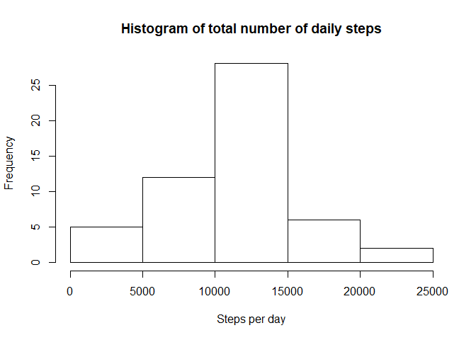
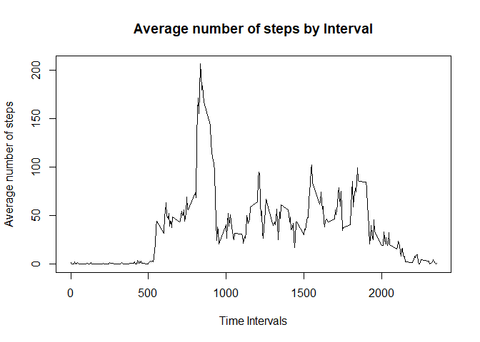
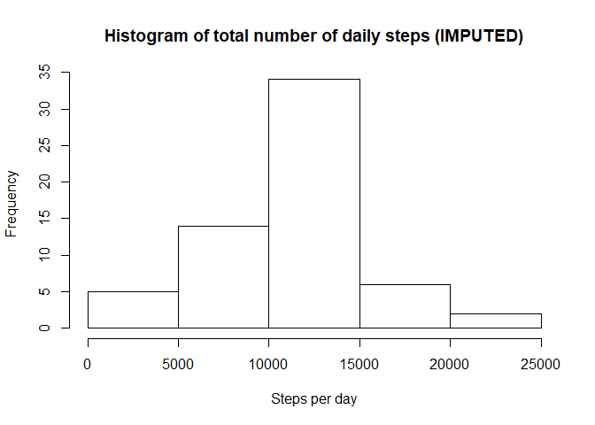
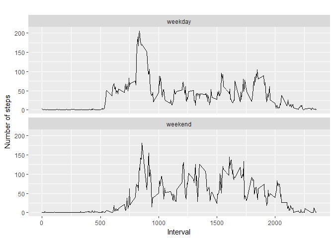

## Add required packages

Add reqired packages:


```r
require("knitr")
```

```
## Loading required package: knitr
```

```r
require("mice")
```

```
## Loading required package: mice
```

```
## Loading required package: lattice
```

```r
require("ggplot2")
```

```
## Loading required package: ggplot2
```

## Step 1: Load & process the data

```r
temp <- tempfile()
download.file("https://d396qusza40orc.cloudfront.net/repdata%2Fdata%2Factivity.zip", temp)
data <- read.csv(unz(temp, "activity.csv"), as.is = TRUE)
cleanData <- data[complete.cases(data), ]
unlink(temp)
```

## Step 2: Make a histogram of the total number of steps taken each day

```r
# Calculate the total number of daily steps
  dailySteps <- aggregate(steps ~ date, cleanData, sum)

# Create a histogram of no. of daily steps
  hist(dailySteps$steps, main = "Histogram of total number of daily steps", xlab = "Steps per day")
```

<!-- -->

## Step 3: Report the mean and mdeain of steps taken each day

```r
# Calculate the mean and median of the total number of daily steps
  round(mean(dailySteps$steps))
```

```
## [1] 10766
```

```r
  median(dailySteps$steps)
```

```
## [1] 10765
```

## Step 4: Add a time series plot of the average number of steps taken

```r
# Calculate average steps per interval for all days 
  avgIntervalSteps <- aggregate(steps ~ interval, cleanData, mean)

# Plot the time series with appropriate labels and heading
  plot(avgIntervalSteps$interval, avgIntervalSteps$steps, type='l', col=1, main="Average number of steps by Interval", xlab="Time Intervals", ylab="Average number of steps")
```

<!-- -->

## Step 5: Isolate the 5 minutes interval that, on average contains the maximum number of steps

```r
# Identify the interval index which has the highest average steps
  interval_idx <- which.max(avgIntervalSteps$steps)

# Identify the specific interval and the average steps for that interval
  print (paste("The interval with the highest avg steps is ", avgIntervalSteps[interval_idx, ]$interval, " and the no of steps for that interval is ", round(avgIntervalSteps[interval_idx, ]$steps, digits = 1)))
```

```
## [1] "The interval with the highest avg steps is  835  and the no of steps for that interval is  206.2"
```

## Step 6: Show code to describe a strategy for imputing missing data.
Here were are using the mice package to generate new data using predictive mean matching (pmm). To simplify things, we are only keeping the 1st of 3 imputations, but a more robust process could be written to pool all imputations. 

```r
# Devise a strategy & create a new dataset that is equal to the original but with the missing data filled in
  imputedData <- mice(data, m=5, method = "pmm", maxit = 3)
```

```
## 
##  iter imp variable
##   1   1  steps
##   1   2  steps
##   1   3  steps
##   1   4  steps
##   1   5  steps
##   2   1  steps
##   2   2  steps
##   2   3  steps
##   2   4  steps
##   2   5  steps
##   3   1  steps
##   3   2  steps
##   3   3  steps
##   3   4  steps
##   3   5  steps
```

```r
  completeData <- complete(imputedData, 1)
```

## Step 7: Generate a histogram of the total number steps taken each day after missing values are imputed

```r
# Calculate the total number of daily steps
  imputedDailySteps <- aggregate(steps ~ date, completeData, sum)

# Create a histogram of no. of daily steps
  hist(imputedDailySteps$steps, main = "Histogram of total number of daily steps (IMPUTED)", xlab = "Steps per day")
```

<!-- -->

```r
# Calculate the mean and median of the total number of daily steps
  round(mean(imputedDailySteps$steps))
```

```
## [1] 10719
```

```r
  median(imputedDailySteps$steps)
```

```
## [1] 10610
```

## Step 8: Generate a panel plot comparing the average number of steps taken per 5-minute interval across weekdays and weekends

```r
  completeData['type_of_day'] <- weekdays(as.Date(completeData$date))
  completeData$type_of_day[completeData$type_of_day  %in% c('Saturday','Sunday') ] <- "weekend"
  completeData$type_of_day[completeData$type_of_day != "weekend"] <- "weekday"

# convert type_of_day from character to factor
  completeData$type_of_day <- as.factor(completeData$type_of_day)

# calculate average steps by interval across all days
  df_imputed_steps_by_interval <- aggregate(steps ~ interval + type_of_day, completeData, mean)

# creat a plot
  qplot(interval, 
        steps, 
        data = df_imputed_steps_by_interval, 
        type = 'l', 
        geom=c("line"),
        xlab = "Interval", 
        ylab = "Number of steps", 
        main = "") +
    facet_wrap(~ type_of_day, ncol = 1)
```

```
## Warning: Ignoring unknown parameters: type
```

<!-- -->
